  

  

  <h2>
    
    Elite Tech Arsenal

```mermaid
mindmap
  root((Tech Universe))
    Frontend Mastery
      ⚛️ React
      🅰️ Angular
      📱 TypeScript
      🎨 Tailwind
    Backend Arsenal
      ☕ Java & Spring
      🐍 Python & Django
      ⚡ Node.js
      🔄 REST APIs
    Cloud & DevOps
      ☁️ AWS
      🐳 Docker
      🔄 CI/CD
      👷 Jenkins
    Database Command
      💾 MySQL
      🐘 PostgreSQL
      📊 MariaDB
    Architecture
      🏗️ System Design
      🔄 Microservices
      🌐 Distributed Systems
```
    
  </h2>

  <h2>🏆 Professional Excellence & Impact</h2>

<table>
  <tr>
    <td align="center">
      
      <h3>DBS Bank Superstar</h3>
      

        
      

      
<em>Reduced Payment Processing Time by 50%</em>

    </td>
    <td align="center">
      
      <h3>Academic Excellence</h3>
      

        
      

      
<em>3.93/4.0 GPA at Georgia State</em>

    </td>
  </tr>
  <tr>
    <td align="center">
      
      <h3>EdLight Innovation</h3>
      

        
      

      
<em>Increased Student Engagement by 35%</em>

    </td>
    <td align="center">
      
      <h3>Research Impact</h3>
      

        
      

      
<em>Scopus-Indexed Research Publication</em>

    </td>
  </tr>
</table>

  <h2>🎯 Technical Proficiency</h2>

  <h3>Frontend Ecosystem 🌐</h3>
  
  
  
   
  <h3>Backend & Systems 🔧</h3>
  
  
  
   
  <h3>DevOps & Cloud ☁️</h3>
  
  
  
   
  <h3>Database Technologies 💾</h3>
  
  
  

 

  <h2>📊 Performance Analytics</h2>
  

  <h2>🌟 Connect & Collaborate</h2>
  
  
  

  

  
   
  <em>💫 Engineering Excellence Through Innovation 💫</em>

