<div align="center">
  
</div>

<h1 align="center">
  
  Sai Pranith Patibandla
  
</h1>

<div align="center">
  
</div>

<p align="center">
  <em>🎓 Master's in CS @ Georgia State University | 🏢 Full Stack Engineer | 🌟 Tech Innovator</em>
</p>

> 🚀 Transforming ideas into reality through code. From revolutionizing SWIFT payment systems to crafting AI-powered solutions, I'm on a mission to make technology more impactful and accessible.

## 🎯 Tech Arsenal & Superpowers

```javascript
const pranithTechUniverse = {
    architect: ["Full Stack Development", "System Design", "Cloud Solutions"],
    languages: {
        expert: ["JavaScript", "TypeScript", "Python", "Java"],
        proficient: ["C++", "C#", "Shell Scripting"],
    },
    frontendMagic: {
        frameworks: ["⚛️ React", "🅰️ Angular"],
        styling: ["🎨 Tailwind", "🅱️ Bootstrap", "💅 Material UI"],
        state: ["Redux", "Context API", "RxJS"]
    },
    backendPowers: {
        java: ["🍃 Spring Boot", "🔄 Spring Batch", "🌐 Spring MVC"],
        python: ["🦄 Django", "🤖 Machine Learning"],
        js: ["⚡ Node.js", "🚀 Express"]
    },
    devOpsTools: ["☁️ AWS", "🐳 Docker", "👷 Jenkins", "🔄 CI/CD"],
    databases: ["💾 MySQL", "📊 MariaDB", "🐘 PostgreSQL"],
    currentQuest: "Building scalable systems & exploring AI frontiers 🔮"
};
```

## 🌟 Achievement Milestones

<div align="center">
  <table>
    <tr>
      <td align="center">
        
        <br />
        <b>Fintech Pioneer</b>
        <br />
        DBS Bank Innovator
      </td>
      <td align="center">
        
        <br />
        <b>Performance Wizard</b>
        <br />
        46% System Optimization
      </td>
      <td align="center">
        
        <br />
        <b>Published Research</b>
        <br />
        Scopus Indexed
      </td>
      <td align="center">
        
        <br />
        <b>Award Winner</b>
        <br />
        Super Techie @ DBS
      </td>
    </tr>
  </table>
</div>

## 📊 Innovation Metrics

<div align="center">
  
  
</div>

## 🚀 Signature Projects

<div align="center">
  <table>
    <tr>
      <td align="center">
        
        <br />
        <b>🔍 Image Features Narrator</b>
        <br />
        AI-Powered Visual Assistance
        <br />
        <i>Python, CV, Keras, PyTorch</i>
      </td>
      <td align="center">
        
        <br />
        <b>👥 Person Tracking System</b>
        <br />
        Deep Learning Surveillance
        <br />
        <i>CNN, TensorFlow, Computer Vision</i>
      </td>
    </tr>
  </table>
</div>

## 🎯 Professional Evolution

```mermaid
%%{init: {'theme': 'dark', 'themeVariables': { 'primaryColor': '#6f42c1', 'textColor': '#fff' }}}%%
timeline
    title My Tech Journey
    2020 : 🔬 CSIR-IICT
         : Innovation Begins
    2021 : 🏦 DBS Bank
         : Fintech Revolution
    2023 : 🎓 Georgia State
         : Academic Excellence
    2024 : 💡 EdLight
         : Current Adventure
```

<div align="center">
  
</div>



## 🌐 Connect & Collaborate

<div align="center">
  <a href="mailto:patibandlasaipranithedu@gmail.com">
    
  </a>
  <a href="https://www.linkedin.com/in/saipranithpatibandla">
    
  </a>
  <a href="https://github.com/Pranith-21">
    
  </a>
</div>

<div align="center">
  
</div>

<div align="center">
  
  <br />
  <em>💫 Let's build something extraordinary together! 💫</em>
</div>
